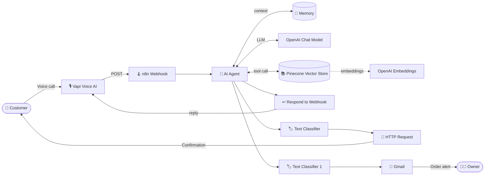
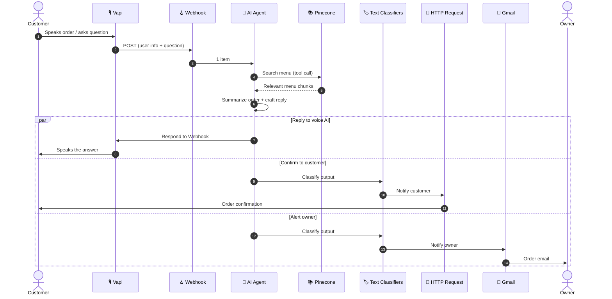
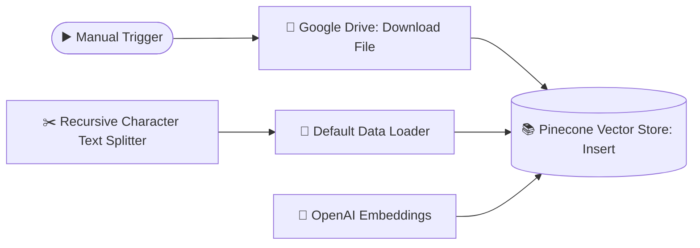

# 🍽️ Restaurant Automation: AI Order-Taking System

> A fully automated, voice-to-order pipeline built in **n8n**. A customer talks to a voice AI, the AI understands the order, answers menu questions from a real knowledge base (RAG), confirms the order to the customer, and notifies the restaurant owner. No human in the loop.


---

## 📌 Table of Contents

1. [The Problem](#-the-problem)
2. [The Solution (TL;DR)](#-the-solution-tldr)
3. [Tech Stack](#-tech-stack)
4. [High-Level Architecture](#-high-level-architecture)
5. [Workflow Breakdown](#-workflow-breakdown)
6. [End-to-End Sequence](#-end-to-end-sequence)
7. [RAG Ingestion Pipeline](#-rag-ingestion-pipeline)
8. [Node-by-Node Reference](#-node-by-node-reference)
9. [Setup Guide](#-setup-guide)
10. [Example Request and Response](#-example-request-and-response)
11. [Design Decisions](#-design-decisions)
12. [Future Improvements](#-future-improvements)
13. [Author](#-author)

---

## ❗ The Problem

Small and mid-size restaurants lose money and customers at the ordering stage:

- 📞 **Missed calls = missed revenue.** During rush hours nobody can pick up the phone.
- 🧑‍🍳 **Staff are stretched thin.** The same person cooking is also taking orders and answering "what's in this dish?"
- ❓ **Repetitive menu questions.** Prices, ingredients, spice level, deals: asked hundreds of times a day.
- 📝 **Manual order errors.** Orders written by hand or typed late get mixed up, forgotten, or misheard.
- 🔔 **No instant confirmation.** Customers are left wondering whether the order actually went through, and the owner finds out late.

**In one line:** ordering depends on humans being available, fast, and accurate every single time, and that doesn't scale.

---

## ✅ The Solution (TL;DR)

An n8n workflow that acts as a **24/7 AI order-taker**:

- 🎙️ Takes the customer's call or message through **Vapi** (voice AI) and receives it at an n8n **Webhook**.
- 🧠 An **AI Agent** (OpenAI) understands the request, **summarizes the order**, and answers menu questions.
- 📚 Menu answers come from a **Pinecone vector store** (RAG) filled from the restaurant's own menu file in Google Drive, so the AI never makes up dishes or prices.
- 📲 The customer gets an **automatic confirmation** through an HTTP request to a messaging API.
- 📧 The owner gets an **instant Gmail notification** with the order details.
- 🔁 The workflow **responds back to Vapi** so the voice AI can speak the result to the customer.

**Result:** customer calls → order is taken → customer is confirmed → owner is notified. Fully automated, zero manual work.

---

## 🧰 Tech Stack

| Layer | Tool | Purpose |
|---|---|---|
| Orchestration | **n8n** | Workflow engine that connects everything |
| Voice / Input | **Vapi** | Voice AI that talks to the customer and calls the webhook |
| LLM | **OpenAI Chat Model** | Understands orders, summarizes, answers questions |
| Embeddings | **OpenAI Embeddings** | Converts menu text into vectors |
| Vector DB | **Pinecone** | Stores and retrieves menu knowledge (RAG) |
| Knowledge source | **Google Drive** | Holds the menu file |
| Classification | **Text Classifier (OpenAI)** | Decides whether to notify the customer or the owner |
| Customer notification | **HTTP Request** (messaging API) | Sends the confirmation to the customer |
| Owner notification | **Gmail** | Sends the order email to the owner |

---

## 🏗️ High-Level Architecture



---

## 🔍 Workflow Breakdown

The n8n canvas is split into **colour-coded sections**. Each one has a single responsibility.

### 🟢 1. User Information (Input)
- A **Webhook node** listens for `POST` requests coming from **Vapi**.
- It receives the customer's details and what they said or ordered.
- It hands the payload to the AI Agent as a single item.

### 🔴 2. AI Agent (Brain)
- The **AI Agent** is the core of the system. It:
  - Understands natural-language orders ("two zinger burgers and a large fries, please").
  - **Summarizes the order** into a clean, structured form.
  - **Answers menu-related questions** (price, ingredients, availability).
- It has three connections:
  - **Chat Model:** OpenAI Chat Model for reasoning.
  - **Memory:** keeps conversation context.
  - **Tool:** Pinecone Vector Store, used to look up menu information.
- Because menu answers are retrieved from the vector store, responses are **grounded in the real menu**, not guessed.

### 🟤 3. Responding Back
- **Respond to Webhook** sends the AI's answer back to Vapi.
- Vapi then speaks that response to the customer, so the conversation feels real-time.

### 🟣 4. Sending Confirmation to Customer
- A **Text Classifier** (with its own OpenAI Chat Model) checks the AI output and routes it down the *notify customer* path.
- An **HTTP Request** node (`POST`) calls a messaging API to send the order confirmation to the customer.

### 🟡 5. Notifying Owner
- A second **Text Classifier** routes the *notify owner* path.
- The **Gmail** node sends a message to the owner with the order summary.

### 🔵 6. RAG (Knowledge Base Setup)
- A separate flow, run manually when the menu changes:
  - **Manual trigger** → **Google Drive** downloads the menu file.
  - **Default Data Loader** reads it, and a **Recursive Character Text Splitter** cuts it into chunks.
  - **OpenAI Embeddings** turns the chunks into vectors.
  - **Pinecone Vector Store** stores them for the agent to search.

---

## 🔄 End-to-End Sequence



---

## 📚 RAG Ingestion Pipeline



**How it works, step by step:**

- 🔹 The menu file is pulled from Google Drive.
- 🔹 The data loader reads the text.
- 🔹 The splitter breaks it into small overlapping chunks so each dish or deal stays meaningful.
- 🔹 Each chunk is converted into an embedding vector.
- 🔹 Vectors are stored in Pinecone.
- 🔹 At order time, the AI Agent queries this store to fetch the most relevant menu details.

> 💡 Update the menu file, re-run this flow, and the AI knows the new menu immediately. No code changes needed.

---

## 🧩 Node-by-Node Reference

| # | Section | Node | Type | Role |
|---|---|---|---|---|
| 1 | Input | Webhook | Trigger | Receives `POST` from Vapi |
| 2 | Brain | AI Agent | Agent | Orchestrates the order and menu Q&A |
| 3 | Brain | OpenAI Chat Model | LLM | Reasoning for the agent |
| 4 | Brain | Memory | Memory | Conversation context |
| 5 | Brain | Pinecone Vector Store 1 | Tool | Retrieves menu knowledge |
| 6 | Brain | Embeddings OpenAI 1 | Embeddings | Query embeddings |
| 7 | Output | Respond to Webhook | Response | Sends the reply back to Vapi |
| 8 | Customer | Text Classifier | Classifier | Routes to customer notification |
| 9 | Customer | OpenAI Chat Model 3 | LLM | Powers classifier |
| 10 | Customer | HTTP Request | API call | Sends the confirmation |
| 11 | Owner | Text Classifier 1 | Classifier | Routes to owner notification |
| 12 | Owner | OpenAI Chat Model 2 | LLM | Powers classifier |
| 13 | Owner | Gmail (Send a message) | Integration | Emails the owner |
| 14 | RAG | Manual Trigger | Trigger | Starts ingestion |
| 15 | RAG | Google Drive (Download file) | Integration | Fetches the menu |
| 16 | RAG | Pinecone Vector Store | Vector store | Inserts embeddings |
| 17 | RAG | Default Data Loader | Loader | Parses the document |
| 18 | RAG | Recursive Character Text Splitter | Splitter | Chunks the text |
| 19 | RAG | Embeddings OpenAI | Embeddings | Embeds the chunks |

---

## ⚙️ Setup Guide

### Prerequisites
- n8n (cloud or self-hosted)
- OpenAI API key
- Pinecone account and index
- Google account (Drive and Gmail OAuth)
- Vapi account
- A messaging API account for customer confirmations

### Steps

1. **Import the workflow**
   - In n8n: *Workflows → Import from File* → select the workflow JSON.

2. **Add credentials** in n8n:
   - OpenAI
   - Pinecone
   - Google Drive (OAuth2)
   - Gmail (OAuth2)
   - Messaging API (token or header auth on the HTTP Request node)

3. **Prepare the Pinecone index**
   - Create an index whose dimension matches your embedding model.
   - Select it in both Pinecone nodes (insert and tool).

4. **Load your menu into the knowledge base**
   - Put the menu file in Google Drive.
   - Point the *Download file* node to it.
   - Click **Execute workflow** on the RAG section.

5. **Connect Vapi**
   - Copy the n8n **Production Webhook URL**.
   - Set it as the server/tool URL in your Vapi assistant.

6. **Activate the workflow** and place a test call.

---

## 📦 Example Request and Response

> Illustrative payload. Adjust the fields to match what your Vapi assistant sends.

**Incoming webhook (from Vapi)**
```json
{
  "customer_name": "Ali",
  "phone": "+92XXXXXXXXXX",
  "message": "I want 2 zinger burgers and one large fries. Is the zinger spicy?"
}
```

**AI Agent output (summarized order)**
```json
{
  "order_summary": [
    { "item": "Zinger Burger", "qty": 2 },
    { "item": "Large Fries", "qty": 1 }
  ],
  "menu_answer": "The Zinger Burger is mildly spicy.",
  "status": "confirmed"
}
```

**What happens next**
- ✅ Vapi speaks the answer to the customer.
- ✅ Customer receives a confirmation message.
- ✅ Owner receives an order email.

---

## 🧠 Design Decisions

- **RAG instead of a hard-coded menu:** update a file, not the workflow.
- **Agent with tool use:** the LLM decides *when* it needs menu data.
- **Separate classifiers for customer and owner:** each channel gets its own routing logic and message.
- **Respond-to-Webhook node:** keeps the voice conversation synchronous and natural.
- **Modular colour-coded sections:** easy to debug, extend, or swap out any part.

---

## 🚀 Future Improvements

- 💳 Payment link generation
- 🗄️ Save orders to a database or Google Sheets for analytics
- 🧾 Kitchen display or printer integration
- 🌐 Multi-language support (Urdu and English)
- 🔄 Order status updates (preparing, out for delivery)
- 🛡️ Error handling and retry branches

---

## 🎯 Final Summary

**The problem:** restaurants lose orders and time because taking calls, answering menu questions, and confirming orders all depend on busy humans.

**The fix:** a fully automated n8n pipeline. A customer speaks to a voice AI (**Vapi**); an **AI Agent** understands and summarizes the order while answering menu questions from a **Pinecone RAG knowledge base** built from the restaurant's own menu; the workflow **replies to the caller**, **confirms to the customer**, and **emails the owner**, all in seconds, all without human involvement.

> **Call → Understand → Answer → Confirm → Notify. Fully automated.**

---

## 👤 Author

**Hassan Khaleeq**: 14-year-old AI agent learner and builder from Pakistan, passionate about creating automations in n8n and exploring new AI tools.

- 🎥 YouTube: *add your channel link here*
- 💼 GitHub: *add your profile link here*

⭐ If you found this useful, consider starring the repo!
